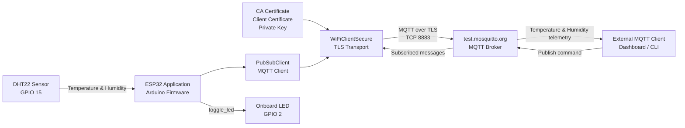

# ESP32 Secure MQTT Communication over TLS

A compact IoT demonstration showing how an ESP32 can publish sensor telemetry and receive remote commands through an MQTT broker using a TLS-secured connection.

The project uses an **ESP32 DevKit**, a **DHT22 temperature/humidity sensor**, `WiFiClientSecure`, and `PubSubClient`. The firmware connects to `test.mosquitto.org` on port `8883`, publishes sensor readings, subscribes to a control topic, and toggles the onboard LED when a command is received.

## What this project demonstrates

- ESP32 Wi-Fi connectivity
- DHT22 temperature and humidity acquisition
- MQTT publish/subscribe communication
- MQTT transport over TLS
- CA certificate configuration
- Client certificate and private-key configuration
- Remote LED control through an MQTT command
- PlatformIO-based firmware development
- Wokwi-compatible ESP32/DHT22 simulation

## System Architecture

The ESP32 acts as a secure IoT node. The DHT22 provides telemetry to the firmware, while the MQTT client sends the readings to the broker through a `WiFiClientSecure` TLS transport. The device also subscribes to a command topic and can toggle the onboard LED when a valid command is received.



An editable Draw.io version of this architecture is provided separately as:

`TLSwithEsp32_Architecture.drawio`

## Hardware

| Component | Role |
|---|---|
| ESP32 DevKit | Main embedded controller |
| DHT22 | Temperature and humidity sensor |
| Onboard LED | Remote-control output |
| Wi-Fi network | Network connectivity |

### Pin mapping

| Signal | ESP32 Pin |
|---|---:|
| DHT22 data | GPIO 15 |
| LED | GPIO 2 |

The Wokwi wiring in the repository connects the DHT22 data pin to GPIO 15, with sensor power connected to the ESP32 supply and ground.

## Software Stack

- Arduino framework for ESP32
- PlatformIO
- `WiFi.h`
- `WiFiClientSecure.h`
- `PubSubClient`
- `DHTesp`
- Wokwi

The current PlatformIO environment targets:

```ini
[env:esp32]
platform = espressif32
framework = arduino
board = esp32dev
```

## MQTT Configuration

The current firmware uses the public Mosquitto test broker:

```text
Broker: test.mosquitto.org
Port:   8883
```

### Published topics

```text
/arun12vak/temp
/arun12vak/hum
```

The ESP32 publishes the current DHT22 temperature and humidity values approximately every two seconds.

### Subscribed topic

```text
/ThinkIOT/Subscribe
```

When the following payload is received:

```text
toggle_led
```

the firmware toggles the LED connected to GPIO 2.

## TLS Security Model

The firmware creates a secure MQTT transport with `WiFiClientSecure` and configures three credential elements:

1. **CA certificate** — used by the ESP32 to validate the broker certificate.
2. **Client certificate** — configured as the device certificate.
3. **Private key** — paired with the client certificate.

The secure transport is then passed to `PubSubClient`, so MQTT traffic travels through the TLS connection.

Conceptually:

```text
ESP32 Application
      |
      v
PubSubClient / MQTT
      |
      v
WiFiClientSecure / TLS
      |
      v
Wi-Fi + Internet
      |
      v
MQTT Broker : 8883
```

## Project Structure

```text
TLSwithEsp32/
└── TLS_projet/
    ├── data/
    │   ├── client.crt
    │   ├── client.key
    │   └── mosquitto.org.crt
    ├── src/
    │   └── esp32-http-server.ino
    ├── diagram.json
    ├── platformio.ini
    ├── wokwi.toml
    ├── .gitignore
    └── LICENSE
```

### Important files

- `src/esp32-http-server.ino` — Wi-Fi, TLS, MQTT, DHT22, and LED-control firmware.
- `platformio.ini` — ESP32 PlatformIO environment and library dependencies.
- `diagram.json` — Wokwi ESP32 and DHT22 wiring.
- `wokwi.toml` — Wokwi firmware configuration.
- `data/` — certificate/key material included in the current project.

## Communication Flow

### 1. Device startup

The firmware:

1. Starts the serial interface.
2. Configures GPIO 2 as the LED output.
3. Initializes the DHT22 on GPIO 15.
4. Connects to Wi-Fi.
5. Loads the CA certificate, client certificate, and private key into `WiFiClientSecure`.
6. Configures the MQTT broker on port 8883.
7. Connects to the MQTT broker.
8. Subscribes to the control topic.

### 2. Telemetry publishing

During the main loop:

1. The ESP32 reads temperature and humidity from the DHT22.
2. Invalid sensor readings are rejected.
3. Temperature is published to `/arun12vak/temp`.
4. Humidity is published to `/arun12vak/hum`.
5. The cycle repeats approximately every two seconds.

### 3. Remote command handling

Incoming MQTT messages are handled by the callback function.

If the payload is exactly:

```text
toggle_led
```

the firmware toggles the onboard LED and reports its new state through the serial monitor.

## Running the Project

### Requirements

- Visual Studio Code
- PlatformIO extension
- ESP32 toolchain
- Internet connection

### Build with PlatformIO

From the `TLS_projet` directory:

```bash
pio run
```

To upload to a physical ESP32:

```bash
pio run --target upload
```

To open the serial monitor:

```bash
pio device monitor
```

### Run with Wokwi

The repository contains:

- `diagram.json`
- `wokwi.toml`

After building the PlatformIO project, Wokwi can use the generated firmware files from:

```text
.pio/build/esp32/firmware.elf
.pio/build/esp32/firmware.bin
```

The Wokwi project uses the `Wokwi-GUEST` network configured in the firmware.

## Testing MQTT Messages

Any MQTT client compatible with TLS can be used to observe the published telemetry or send the LED command.

For example, the expected interaction is:

```text
ESP32 -> Broker:
  /arun12vak/temp = 24.50
  /arun12vak/hum  = 55.20

External Client -> Broker:
  /ThinkIOT/Subscribe = toggle_led

Broker -> ESP32:
  toggle_led

ESP32:
  GPIO 2 state changes
```

## Security Notice

This repository is suitable as a **learning/demo project**, not as a production credential-management example.

The current repository contains client credential material, including a private key, and the firmware also embeds certificate/key material directly in source code. Because the repository is public, those credentials should be treated as exposed and should **not** be reused for a real deployment.

For a production design:

- Generate new device-specific credentials.
- Revoke or replace exposed credentials.
- Never commit private keys to a public repository.
- Store secrets outside the application source code.
- Use a private or authenticated MQTT broker.
- Add device identity and authorization policies.
- Add certificate rotation and expiry handling.
- Define reconnect/backoff behavior and offline buffering.
- Use unique MQTT client IDs per device.

## Possible Improvements

- Move credentials out of the source file.
- Add a secure provisioning mechanism.
- Use unique MQTT topics per device.
- Publish telemetry as structured JSON.
- Add MQTT QoS and retained-message policies where appropriate.
- Add reconnection backoff instead of retrying indefinitely.
- Add watchdog/error handling.
- Add timestamps and device identifiers to telemetry.
- Add a backend/dashboard for visualization.
- Replace the public test broker with a controlled MQTT deployment.
